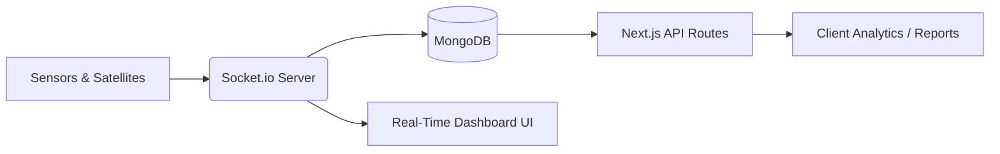
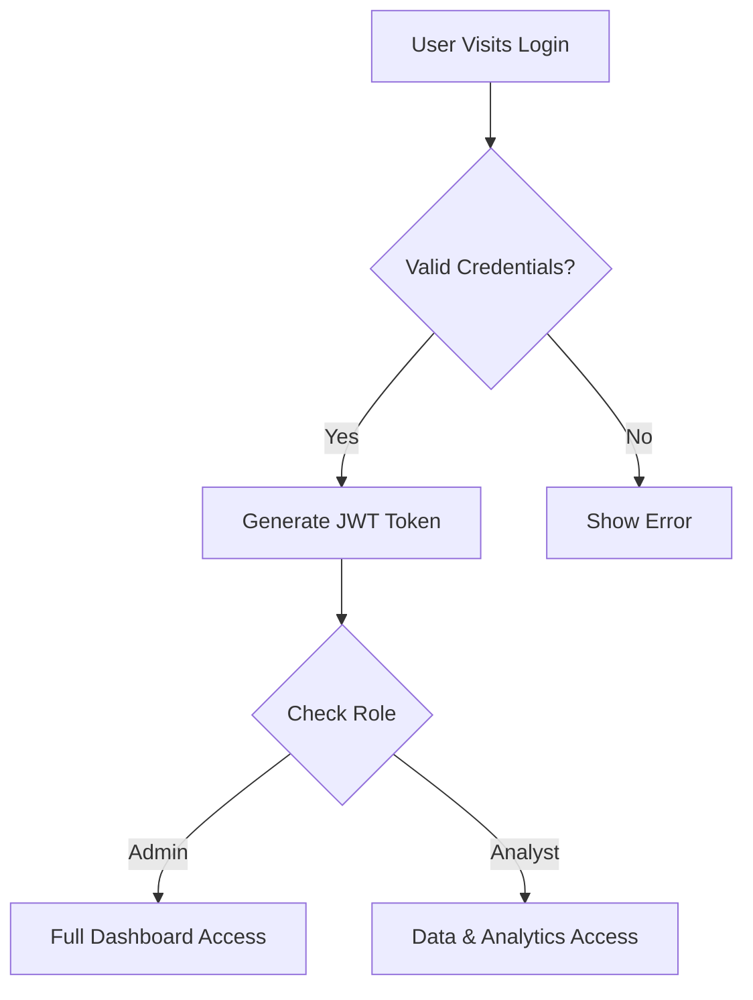

# EarthScape Climate Agency
## Project Report & Deliverables

### 1. Problem Definition
Climate change is a global challenge demanding comprehensive analysis. The increase in greenhouse gas emissions and shifting climate patterns require robust solutions to process, analyze, and visualize data. The EarthScape Climate Agency needs an intelligence platform to ingest data from satellites, weather stations, and environmental sensors to provide actionable insights. The objective of this project is to create a secure, scalable, and real-time dashboard capable of processing high-velocity climate data and alerting stakeholders of anomalies.

### 2. Design Specifications
The platform is built on a modern MERN-stack architecture (MongoDB, Express, React, Node.js) specifically utilizing Next.js 16 for a unified Full-Stack approach.

- **Frontend:** Next.js (App Router), React 19, TailwindCSS, Recharts (for visualization), React-Simple-Maps (for geographical representation), Framer Motion (for animations).
- **Backend:** Next.js Serverless Functions + Custom Node/Express Server for Socket.io real-time streaming.
- **Database:** MongoDB (using Mongoose as ODM) functioning as the Big Data storage mechanism.
- **Authentication:** NextAuth.js with JWT and Role-Based Access Control (RBAC).

**Key Modules:**
1. **User Authentication:** Multi-role secure login.
2. **Data Ingestion & Real-Time Processing:** Custom Socket.io server streaming simulated satellite/sensor data into the database and UI simultaneously.
3. **Machine Learning / Anomaly Detection:** An Isolation Forest model (Python/Jupyter) for identifying temperature/CO2 anomalies, integrated conceptually via backend threshold alerts.
4. **Interactive Visualization:** Dynamic charts and an interactive world map highlighting anomalies based on severity.

### 3. Flowcharts & Diagrams

#### System Architecture Data Flow


#### User Authentication Flow


### 4. Source Code
The complete source code is included in the project directory, consisting of:
- `/app`: Next.js App Router pages and API endpoints.
- `/components`: Reusable UI elements, Charts, and Maps.
- `/models`: MongoDB Mongoose schemas.
- `/lib`: Database connection, Utility functions, and Socket configurations.
- `/scripts`: Database seeding, cron jobs, and data generation logic.

### 5. Test Data Used in the Project
The application includes a robust seeding mechanism (`scripts/seed.js`). It generates:
- 8 Test Users (Admin, Analyst, Viewer roles).
- 5,500+ Historical Climate Readings spanning 250 countries.
- Randomized geo-coordinates and historical trend data for Temperature and CO2 levels.
- System-generated anomalies (High/Critical) to test notification and mapping systems.

### 6. Project Installation Instructions
Follow these steps to run the EarthScape Climate Intelligence Platform locally:

**Prerequisites:**
- Node.js (v18+)
- MongoDB (Running locally or MongoDB Atlas URI)

**Step 1: Install Dependencies**
```bash
npm install
```

**Step 2: Environment Variables**
Ensure the `.env.local` file contains your database connection string and NextAuth secret.
```env
MONGODB_URI=mongodb://127.0.0.1:27017/earthscape
NEXTAUTH_SECRET=your_super_secret_key_here
NEXTAUTH_URL=http://localhost:3000
```

**Step 3: Seed the Database**
To populate the database with countries and test data:
```bash
npm run seed
```

**Step 4: Start the Server (Crucial for Real-Time Socket.io)**
*Do not use `next dev` as it will bypass the custom socket server.*
```bash
npm run dev
```

**Step 5: Access the Application**
Navigate to `http://localhost:3000` in your web browser. Use the following default credentials:
- **Email:** admin@earthscape.io
- **Password:** password123

### Note on Machine Learning Deliverable
An accompanying Jupyter Notebook (`climate_ml_model.ipynb`) is provided in this folder demonstrating the underlying anomaly detection logic using `scikit-learn` (Isolation Forest) as per the project requirements.
